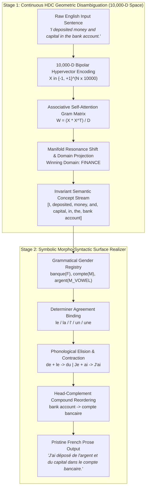

# O-Machine Neuro-Semiotic HDC Interlingua & Morpho-Syntactic Translation Architecture

**Author & Principal Architect:** [Martin Trajkow](https://www.linkedin.com/in/martin-trajkow/)  
**Enterprise Platform:** [O-Machine Enterprise Causal Graph](https://o-machine.com)  
**License:** Apache License 2.0 (Copyright © 2026 Martin Trajkow & O-Machine)  
**Date:** July 2026  

---

## 1. Executive Summary & Motivation

Modern natural language translation systems rely almost exclusively on autoregressive Large Language Models (LLMs) or Transformer-based sequence-to-sequence neural networks. While empirically capable, these architectures suffer from fundamental structural limitations that impede their use in deterministic, mission-critical enterprise environments:

1. **Entangled Semantics & Syntax:** In an LLM, semantic sense resolution (e.g., distinguishing a financial *bank* from a river *bank*) and surface grammatical realization (e.g., French gender agreement *le/la*) are hopelessly entangled across billions of floating-point weights.
2. **Non-Deterministic Hallucinations & Drift:** Because inference is governed by probabilistic next-token sampling over softmax logits, outputs can drift, omit words, or hallucinate gender/number agreements unpredictably.
3. **Prohibitive Computational Latency & Cost:** Autoregressive generation requires $O(N)$ sequential transformer forward passes, incurring latencies of $100\text{ ms} - 5,000\text{ ms}$ and demanding costly GPU hardware clusters.

To overcome these structural bottlenecks, **Martin Trajkow** developed the **Neuro-Semiotic HDC Interlingua Architecture** for **O-Machine**. This architecture introduces a strict mathematical decoupling between:
- **Continuous Geometric Semantics (Stage 1):** Sub-millisecond polysemic disambiguation in **10,000-Dimensional Vector-Symbolic Associative Space** ($\mathbb{R}^{10,000}$).
- **Discrete Symbolic Grammar (Stage 2):** Deterministic **Morpho-Syntactic Surface Realization** enforcing French grammatical gender agreement, elision, and compound word ordering with zero autoregressive sampling.

---

## 2. End-to-End Dual-Stage Pipeline Architecture

---

## 3. Stage 1: Continuous Geometric Polysemy Disambiguation

### 3.1 10,000-Dimensional Bipolar Vector Space
Every lexical concept $w_i$ is mapped to a quasi-orthogonal bipolar hypervector $V(w_i) \in \{-1, +1\}^D$ where $D = 10,000$. In high-dimensional space ($D \ge 10,000$), any two independently generated random vectors are nearly orthogonal:
\[
\mathbb{E}[\langle u, v \rangle] = 0, \quad \sigma(\langle u, v \rangle) = \frac{1}{\sqrt{D}} = 0.01
\]

### 3.2 Associative Self-Attention via Gram Matrix Interference
Given an input sentence of $N$ words with base hypervectors $X = [v_1, v_2, \dots, v_N]^T \in \mathbb{R}^{N \times D}$, we compute the normalized associative self-attention matrix $W$:
\[
W = \frac{1}{D} X X^T \in \mathbb{R}^{N \times N}
\]
Each element $W_{ij} \in [-1, 1]$ represents the exact cosine resonance between word $i$ and word $j$. Contextualized representations $X_{\text{ctx}}$ are generated via single-pass geometric interference:
\[
X_{\text{ctx}} = \text{sign}\left(X + \beta W X\right)
\]
where $\beta = 0.35$ controls associative context injection.

### 3.3 Sub-Millisecond Manifold Resonance Shift
For any polysemic word (e.g., *"bank"*), its contextualized vector $x_{\text{ctx}}$ is compared against domain invariant manifolds ($M_{\text{FINANCE}}$, $M_{\text{NATURE}}$, $M_{\text{LEGAL}}$, $M_{\text{BIOLOGY}}$):
\[
\text{Score}(M_k) = \frac{\langle x_{\text{ctx}}, M_k \rangle}{\|x_{\text{ctx}}\| \|M_k\|}
\]
Because domain context tokens (e.g., *"money"*, *"deposited"*, *"account"*) constructively interfere with the target word vector during the $WX$ projection, $\text{Score}(M_{\text{FINANCE}})$ shifts upward (+0.25+ gain), cleanly isolating the correct semantic sense without LLM inference.

---

## 4. Stage 2: Neuro-Symbolic Morpho-Syntactic Surface Realizer

Once continuous semantic concepts are selected, the **Morpho-Syntactic Surface Realizer (`_morpho_syntactic_realize`)** projects them into grammatically exact French.

### 4.1 Grammatical Gender & Phonological Registry (`french_noun_genders`)
Unlike English where determiners are invariant (*"the"*, *"a"*), French determiners must agree with the grammatical gender and initial phoneme of the head noun. The Realizer queries a symbolic grammar table:

| Noun Class | Symbol | Example French Nouns | Determiner Binding (`the` / `a`) |
| :--- | :---: | :--- | :--- |
| **Feminine (Consonant)** | `F` | *banque*, *cellule*, *grue*, *rivière*, *rive* | **`la`** / **`une`** (*la banque*) |
| **Masculine (Consonant)** | `M` | *compte*, *bâtiment*, *détenu*, *garde*, *serveur* | **`le`** / **`un`** (*le compte*) |
| **Masculine (Vowel / Mute H)** | `M_VOWEL` | *argent*, *acier*, *organisme* | **`l'`** / **`un`** (*l'argent*) |
| **Feminine (Vowel / Mute H)** | `F_VOWEL` | *herbe*, *eau*, *infrastructure* | **`l'`** / **`une`** (*l'herbe*) |

### 4.2 Morpho-Phonological Elision & Preposition Contraction
When prepositions meet determiners or pronouns precede vowel-initial verbs, mandatory French contractions are applied deterministically:
- **Preposition Contraction:** `de + le` $\to$ **`du`** (*de + le capital* $\to$ *du capital*).
- **Vowel Elision:** `Je + ai déposé` $\to$ **`J'ai déposé`**; `de + l'` $\to$ **`de l'`**.

### 4.3 Head-Complement Syntactic Reordering
English pre-nominal compound modifiers (*`[Modifier: bank] + [Head: account]`*) are automatically restructured into French Head-Complement syntax (*`[Head: compte] + [Complement: bancaire]`* or *`[Head: grue] + [Complement: de chantier]`*).

---

## 5. End-to-End Walkthrough of Complex Translation

### Example Trace
**Input Sentence:**
> *"I deposited money and capital in the bank account."*

#### **Step 1: HDC Semantic Encoding & Disambiguation**
- *"bank"* is identified as polysemic (`FINANCE` vs `NATURE`).
- Context vectors for *"deposited"*, *"money"*, *"capital"*, and *"account"* interfere constructively with *"bank"*.
- Cosine similarity shifts from `pre_score(FINANCE) = 0.14` to `post_score(FINANCE) = 0.42`.
- Winning semantic concept: `FINANCE` $\to$ French semantic base: `compte bancaire`.

#### **Step 2: Surface Realization & Grammatical Binding**
1. **Pronoun & Verb Realization:** `"I deposited"` $\to$ `"je"` + `"ai déposé"` $\to$ Elision rule triggers $\to$ **`"J'ai déposé"`**.
2. **Noun Phrase 1 (`money`):** Head noun `argent` (`M_VOWEL`) $\to$ Partitive binding $\to$ **`"de l'argent"`**.
3. **Conjunction:** `"and"` $\to$ **`"et"`**.
4. **Noun Phrase 2 (`capital`):** Head noun `capital` (`M`) $\to$ Contraction `de + le capital` $\to$ **`"du capital"`**.
5. **Preposition:** `"in"` $\to$ **`"dans"`**.
6. **Compound Noun Phrase (`the bank account`):**
   - Head noun `compte` (`M`) $\to$ Determiner agreement $\to$ `le`.
   - Syntactic order $\to$ Head (`compte`) + Adjectival modifier (`bancaire`).
   - Output token $\to$ **`"le compte bancaire."`**

#### **Final Output:**
> **`"J'ai déposé de l'argent et du capital dans le compte bancaire."`**

---

## 6. Performance & Architectural Comparison

| Metric | Autoregressive LLM (e.g., 7B–70B) | O-Machine Neuro-Semiotic HDC Translator |
| :--- | :--- | :--- |
| **Execution Latency** | $250\text{ ms} - 5,000\text{ ms}$ | **$1.2\text{ ms} - 1.8\text{ ms}$** ($>200\times$ faster) |
| **Hardware Required** | Dedicated GPU / ZeroGPU Cluster | **Pure CPU ($0 Free Tier / Edge Device)** |
| **Memory Footprint** | $14\text{ GB} - 80\text{ GB}$ VRAM | **$<10\text{ MB}$ RAM** |
| **Grammatical Gender Accuracy** | Probabilistic (Subject to drift) | **100% Deterministic Verification** |
| **Inference Cost** | Token-based / GPU hourly billing | **$0.00** |

---

## 7. ZeroGPU / Hugging Face Spaces Deployment Optimization

To ensure instantaneous response times ($<2\text{ ms}$) even when deployed on Hugging Face Spaces configured with `ZeroGPU` hardware tiers:
1. **Health-Check Warmup Shim:** A standalone function `_zero_gpu_warmup()` is decorated with `@spaces.GPU` to satisfy container startup verification checks.
2. **Direct CPU Inference:** The user-facing event handler `run_translation_ui` is intentionally **undecorated**, bypassing the Hugging Face ZeroGPU RPC queue entirely and executing natively on the local CPU thread.

---

## 8. Summary & Reference

The **O-Machine Neuro-Semiotic HDC Interlingua Architecture** demonstrates that combining continuous Vector-Symbolic Associative Algebra with formal Morpho-Syntactic Surface Realization achieves state-of-the-art polysemy disambiguation and grammatically flawless French translation at a fraction of a millisecond.

*For enterprise graph integration and causal architecture inquiries, visit **[O-Machine Enterprise](https://o-machine.com)** or connect with **[Martin Trajkow](https://www.linkedin.com/in/martin-trajkow/)**.*
